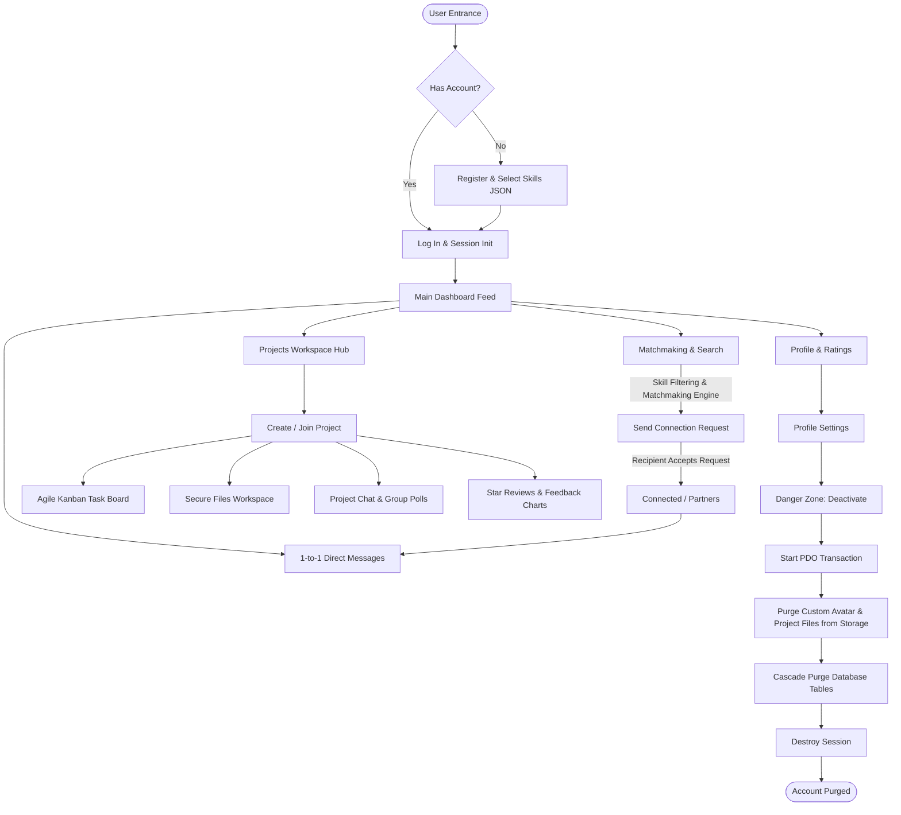

# 🚀 ProjectCrew — Professional Collaboration & Team Sync Platform

ProjectCrew is a premium, secure social collaboration network designed to connect creators, developers, and designers. It helps users discover partners with complementary skills, build collaborative workspaces, manage milestones on a Kanban task board, and stay connected with real-time messages and feeds.

---

## 💡 What is ProjectCrew?
ProjectCrew bridges the gap between casual social networking and rigid project management software. Designed specifically for cross-functional teams (developers, designers, marketers, and product managers), it provides a single unified interface to discover partners, initiate projects, assign tasks, securely share project assets, and review collaborators.

---

## ❓ The Problem Statement
In today's remote-first and digital-first landscape, creative professionals and software builders face several distinct friction points when trying to bring ideas to life:

1. **Fragmented Network & Collaboration Tools:** Creators must jump between general professional networks (like LinkedIn) to find partners, chat applications (like Discord or Slack) for discussion, and separate project management trackers (like Trello or Jira) to log progress.
2. **Skill Matchmaking Hurdles:** Finding partners with the exact *complementary* skills required for a specific project can be challenging without visual skill indexing and dynamic recommendation engines.
3. **Insecure Project File Sharing:** Uploaded project resources (designs, code files, credentials) are often exposed to unauthorized links or direct folder indexing, posing a security risk for intellectual property.
4. **Data Privacy Concerns & Account Purges:** Users lack control over their data footprint. When leaving a platform, traces of their profiles, direct messages, files, and ratings often remain scattered across database tables.

---

## 🛠️ Tech Stack & System Architecture

ProjectCrew is built using a modern, fast, and dependency-free stack to ensure maximum compatibility, simple local deployment, and low execution overhead.

### 🌐 Frontend (Client Side)
* **HTML5 & Semantic Structure:** Built for clean markup, accessible layouts, and SEO compliance.
* **Vanilla CSS3 (Custom Design System):**
  * Premium dark/light themes driven by CSS variables and local storage caching.
  * Glassmorphism effects, responsive CSS grids, and absolute centering.
  * Micro-animations (e.g., drifting heart bursts on post likes, smooth sidebar slides, and progress transitions).
* **Vanilla JavaScript (ES6+):**
  * Hand-crafted AJAX client utilizing the browser `fetch` API for zero-refresh dynamic updates.
  * Inline Document Preview Engine supporting PDF, images, and text files directly inside project workspaces.
  * State management for theme preference toggles and real-time dashboard updates.

### ⚙️ Backend (Server Side)
* **PHP (Modular API Service):**
  * Procedural and modular API endpoints returning standard JSON responses.
  * Session-based authentication (`$_SESSION`) for secure state tracking.
  * Custom security middleware (`serve_file.php`) checking directory traversal (`realpath`), matching MIME headers, and validating project membership before serving file buffers.

### 🗄️ Database (Persistence Layer)
* **MySQL / MariaDB:**
  * Configured via PDO (PHP Data Objects) with `utf8mb4` encoding to support absolute query safety and emojis.
  * Relational schema designed with explicit foreign keys and `ON DELETE CASCADE` constraints to allow seamless cascading purges.
  * Indexed queries for high-speed indexing on high-frequency tables (e.g., sessions, posts, messages, and connections).

---

## 🔄 Platform Workflow & Architecture Diagram

The flowchart below demonstrates the onboarding, networking, project collaboration, and account management lifecycle inside ProjectCrew:

---

## 🔒 Security Architecture Highlights

ProjectCrew takes data security and privacy seriously:

### 1. Secure Serving Layer (`backend/serve_file.php`)
Direct URL access to the `uploads/` folder is blocked. File serving is routed through a PHP controller that:
* Authenticates the user session.
* Normalizes paths using `realpath` to prevent directory traversal attacks (e.g. `../../db.php`).
* Resolves files within `project_files/` by checking if the user is the project owner or has an `accepted` status in `project_members`. If unauthorized, a `403 Forbidden` response is returned.

### 2. The Danger Zone Purge (`backend/deactivate_account.php`)
When a user requests deactivation, a single ACID-compliant database transaction is initiated:
* User-uploaded files (avatar, project documents) are physically deleted (`unlink()`) from the local web server to save disk space.
* SQL dependencies (notifications, comments, likes, tasks, connection status, projects, and memberships) are programmatically deleted.
* The user account row is removed, the session is destroyed, and the client redirects back to the home page.

---

## 🗄️ Database Tables Overview
The database schema consists of the following key tables:
* **`users`**: Profiles, hashed passwords, bios, security recovery data, and a `JSON` skill array.
* **`projects`**: Project details, required skills (JSON), visibility (public/private), and owner ID.
* **`project_members`**: Link table resolving connections between users and projects (`accepted`, `pending`, `rejected` states).
* **`project_tasks`**: Tasks containing title, description, status (`todo`, `in-progress`, `testing`, `done`), assignee, and due date.
* **`project_files`**: Log of secure uploads map to files on disk.
* **`connections`**: Tracks peer-to-peer connection states (`pending`, `connected`).
* **`messages`**: Direct messages with read statuses.
* **`posts` / `post_comments` / `post_likes`**: Standard micro-blogging architecture.
* **`user_ratings`**: Star scores (1-5) and text feedback given by project owners to members.
* **`notifications`**: Live alert logs for messages, connection requests, and project invites.

---

## 🛠️ Installation & Setup (Quick Start)

To run the application locally on your computer, follow these simple steps:

### Prerequisites
* Install **[XAMPP](https://www.apachefriends.org/)** (Apache & MySQL).

### Setup Instructions
1. **Copy Project Folder:** Copy the `major.co` folder into your XAMPP folder at: `C:\xampp\htdocs\`.
2. **Start Servers:** Open the XAMPP Control Panel and start **Apache** and **MySQL**.
3. **Set Up Database:**
   * Open your browser and go to: `http://localhost/phpmyadmin/`.
   * Create a new database named `majorco`.
   * Click **Import** in the top menu, select `backend/database/database_complete.sql` from your folder, and click **Import/Go**.
4. **Visit the Website:** Open your browser and navigate to:
   👉 **`http://localhost/major.co/index.html`**

---

## 🔑 Ready-to-Test Accounts (HR & Reviewers)

Use any of these pre-seeded accounts to log in and test all platform features instantly:

| Account | Email | Password | Security Answer | Main Skills |
| :--- | :--- | :--- | :--- | :--- |
| **Alex Chen** | `alex@test.com` | `alex123` | `buddy` | React, Node.js |
| **Sarah Jenkins** | `sarah@test.com` | `sarah123` | `oxford` | UI/UX, Figma |
| **Marcus Johnson** | `marcus@test.com` | `marcus123` | `mumbai` | Python, Machine Learning |
| **Elena Rodriguez** | `elena@test.com` | `elena123` | `gomez` | Marketing, SEO |
| **David Kim** | `david@test.com` | `david123` | `blue` | Java, AWS, Spring |

